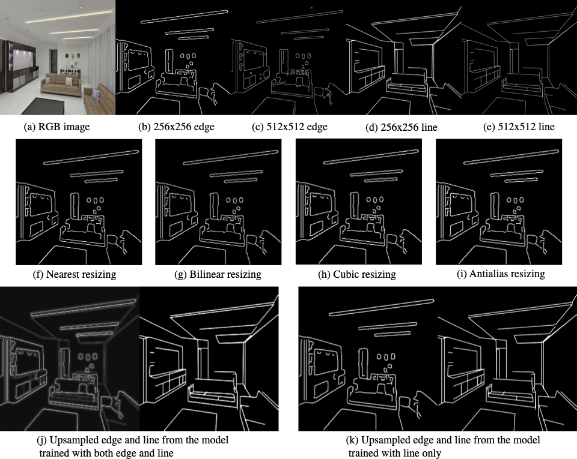

# StructureUpsampling
Simple CNN for line and edge upsampling worked for [ZITS](https://github.com/DQiaole/ZITS_inpainting).

## Results

## Test

The pretrained model can be downloaded in https://drive.google.com/drive/folders/1Dg_6ZCAi0U3HzrYgXwr9nSaOLnPsf9n-?usp=sharing.

## Train

Note that only line(wireframe) is used as the training target. And the trained model can work for both line and edge(canny).

1. Preprocess and get pkl of lines(wireframes) from images with [LSM-HAWP](https://github.com/ewrfcas/MST_inpainting).

2. Setting image file lists (train.txt, val.txt, test.txt) and wireframe path (wireframe_path) in configs/config.yml

3. python trian.py

